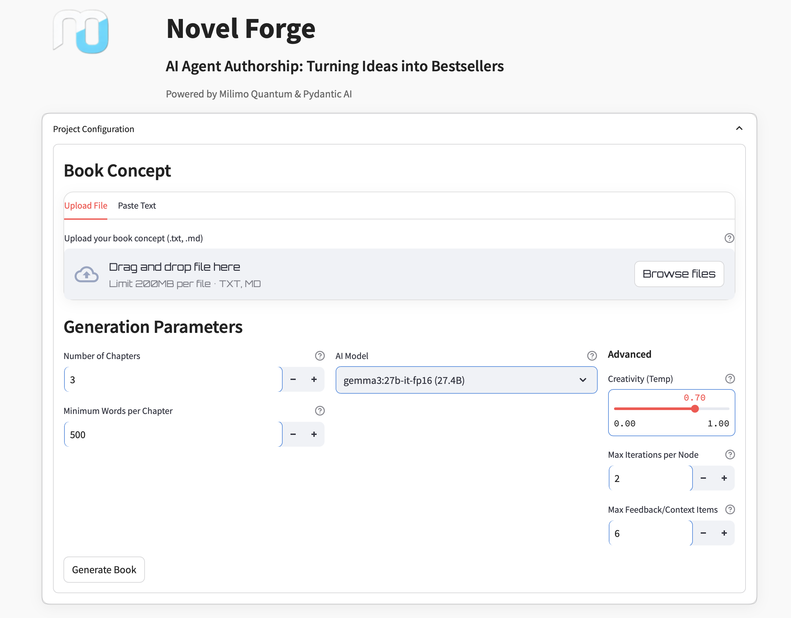
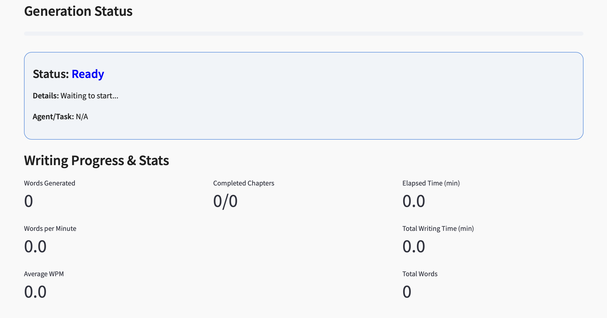

# NovelForge AI Book Generator

NovelForge is a sophisticated AI authorship platform that orchestrates a **collaborative team of specialized AI agents** through a **persistent, feedback-driven graph workflow** to generate entire novels from a simple concept. It deeply integrates **pydantic-ai** for multi-agent coordination and **pydantic-graph** for modular, resumable orchestration, leveraging local LLMs via **Ollama** and cloud models via **OpenRouter**.

---


## Key Features

- **Persistent Graph Workflow:** Built with `pydantic_graph`, defining a detailed, checkpointed graph of 40+ nodes covering market analysis, concept development, outlining, worldbuilding, character creation, writing, review, editing, formatting, exporting, and reporting.
- **Explicit Multi-Agent Collaboration:** Uses `pydantic-ai` to instantiate dozens of specialized agents (Writer, Reviewer, Editor, World Builder, Dialogue Specialist, etc.) via the `BookAgents` factory, each an `EnhancedAgent` supporting explicit feedback channels.
- **Iterative Feedback Loops:** Agents exchange structured feedback explicitly (`process_with_feedback`), enabling multi-round refinement during writing and review phases.
- **Advanced Concept Propagation:** The initial concept is refined by a dedicated agent node into a canonical `refined_concept`, which is used by all downstream nodes and agent prompts. There are no arbitrary or restrictive integrity checks—creative evolution is fully agent-driven and robust.
- **Adaptive Model Selection:** Dynamically chooses optimal models (Ollama or OpenRouter) per agent role and task complexity, with caching and provider fallback.
- **Checkpointing & Resumability:** Uses `FileStatePersistence` to persist graph state and agent context after key nodes, supporting full recovery and incremental development.
- **Advanced Summarization & Reference Management:** Generates chapter and combined summaries, verifies and annotates cross-references with fuzzy matching and auto-updates.
- **Multi-Stage Review Pipeline:** Includes peer review simulation, editorial review, consistency checks, style refinement, flow enhancement, structural and line editing, coordinated via explicit graph nodes.
- **Quality Metrics & Heuristics:** Calculates readability scores (Flesch-Kincaid, SMOG, Coleman-Liau), dialogue ratio, description density, engagement, and style consistency to guide rewrites.
- **Publishing Preparation:** Generates front/back matter, metadata, and exports to Markdown, EPUB, PDF, DOCX.
- **Rich Streamlit UI:** Authentication, concept input, parameter tuning, live progress streaming, interactive charts (POV distribution, agent activity, chapter progress), multi-format export (Markdown, EPUB, PDF, DOCX).
- **Local & Cloud LLM Support:** Integrates with Ollama (local models) and OpenRouter (cloud models) via OpenAI-compatible APIs.
- **Logfire Integration:** Optional detailed monitoring and tracing.
- **Version Control:** Maintains full version history of state and chapters, supporting diffs, restores, and annotations.

---

## Workflow Details

### Concept Propagation & Refinement
- The workflow begins with an `initial_concept` provided by the user.
- A specialized agent node (DevelopConcept) refines this concept using advanced LLMs and agentic feedback, producing a `refined_concept`.
- The `refined_concept` becomes the canonical source of truth for all subsequent nodes, prompts, and agent tasks.
- If for any reason the refined concept is unavailable, the system safely falls back to the initial concept.
- There are no arbitrary or restrictive “concept integrity” checks: the workflow is fully agent-driven, empowering creative and meaningful evolution of the core idea.
- This approach ensures maximum flexibility, robustness, and creative power, strictly following the pydantic-ai agent framework.

1.  **Start Generation:** Initialize state with concept and config.
2.  **Market Analysis & Positioning:** Analyze market, genre, audience, comparables.
3.  **Generate Publishing Proposal:** Create a proposal based on market insights.
4.  **Generate Title:** Create a catchy book title.
5.  **Develop Concept:** Refine and expand the initial idea using extracted elements and market insights.
6.  **Plot Scaffolding & Pacing:** Generate plot outline, adjust pacing, create transition plans.
7.  **Plot Architecture:** Design overall plot structure and arcs.
8.  **Create Outline:** Generate a detailed chapter-by-chapter outline.
9.  **Build World & Develop Characters:** Generate world details and character profiles.
10. **Refine World & Characters:** Cross-inform world and character details based on each other.
11. **Write Chapters:** Coordinate multi-agent writing (narrative, description, dialogue) with iterative feedback and continuity checks. Includes internal review/revision loops per chapter.
12. **Verify Cross-References:** Annotate, auto-update, and map references.
13. **Generate Summaries:** Create chapter and combined summaries for context.
14. **Multi-Stage Review:** Execute parallel reviews (Peer, Editorial, Consistency, Style, Flow).
15. **Aggregate Reviews & Decide:** Combine feedback, detect conflicts, decide on rewrites or proceed. (May loop back to Write Chapters).
16. **Evaluate Quality Metrics:** Calculate readability, heuristics, etc. (May trigger rewrites).
17. **Generate Front & Back Matter:** Create copyright, dedication, about author, acknowledgments.
18. **Assemble Book:** Combine approved chapters and front/back matter.
19. **Polish Book:** Perform final polishing edits.
20. **Format Book:** Apply consistent formatting.
21. **Save & Export:** Save final Markdown, generate EPUB, PDF, DOCX, and save stats JSON.
22. **Final Report:** Generate a summary report of the process.

---

## User Interface Enhancements

- **Login System:** Secure access with username/password ([`streamlit-authenticator`](https://github.com/mkhorasani/Streamlit-Authenticator)).
- **Interactive Charts:** Visualize POV distribution, agent activity, and chapter progress using [`streamlit-echarts`](https://github.com/andfanilo/streamlit-echarts).
- **Export Options:** Download final book in Markdown, EPUB, PDF, and DOCX formats, plus JSON stats.
- **Live Progress Streaming:** Real-time updates and AI output during generation.
- **Configuration:** Set concept, chapters, model, temperature, iteration limits via UI.
- **Monitoring:** View detailed stats and system resource usage.
- *Future Enhancements:* Planned features include interactive plot boards and character editors.



---

## Key Agent Specializations

NovelForge employs a diverse team of AI agents, each with a specific role. Key agents include:

- **Market Analyst & Proposal Agents:** Analyze market, genre, audience, comps to generate a publishing proposal.
- **Concept Developer:** Refines the initial idea into a robust concept.
- **Plot Architect & Outliner:** Design plot structure and chapter outlines.
- **World Weaver & Character Alchemist:** Create detailed world settings and character profiles.
- **Writing Team (Writer, Dialogue Specialist, Description Architect):** Collaboratively draft chapters with iterative feedback.
- **Review & Editing Team (Reviewer, Editor, Consistency Checker, Stylist, Flow Enhancer):** Perform multi-stage reviews and edits.
- **Formatting & Export Agents:** Prepare the final manuscript in various formats.

*Refer to [`novelForge_architecture.md`](novelForge_architecture.md) for a comprehensive list and details.*

Agents exchange structured feedback and utilize adaptive model selection (Ollama/OpenRouter) for optimal performance.


---

## Setup Instructions

### Prerequisites

- Python 3.9+
- [Ollama](https://ollama.ai/) installed and running
- Required Python packages (install via pip):
  ```bash
  pip install -r requirements.txt
  ```
  *(Ensure all dependencies from `requirements.txt` are installed)*

### Model Setup

- Start Ollama:
  ```bash
  ollama serve
  ```
- Pull desired models:
  ```bash
  ollama pull llama3
  ollama pull granite3.2:8b-instruct-fp16
  ollama pull mistral:7b-instruct
  ollama pull granite3.2:8b-instruct-fp16
  ```
- Models are auto-selected per task.

### Run the App

```bash
streamlit run app.py
```

---

## Usage

- Login with your credentials.
- Upload or paste your book concept.
- Configure chapters, word count, temperature, and model.
- Approve/refine concept, outline, characters.
- Start generation.
- Monitor progress, review summaries, download results in multiple formats.

---

## Output

- **Drafts:** `novelForge/books/drafts/`
- **Chapters:** `novelForge/books/chapters/<run_id>/`
- **Run State:** `novelForge/runs/<run_id>.json`
- **Publishing Metadata:** Embedded in state and front/back matter.

---

## Advanced Features

- **Persistence:** Resume interrupted runs.
- **Monitoring:** Progress, agent activity, system resources.
- **Quality Assurance:** Readability, genre alignment, style, engagement.
- **Cross-References:** Annotated, auto-updated, and visualizable.
- **User Control:** Freeze flags for concept, outline, etc.; inject feedback.
- **Professional Publishing:** Publishing proposal generation, front/back matter, multi-stage editing.
- **Adaptive Model Selection:** Chooses best model per task.
- **Export Formats:** Markdown, EPUB, PDF, DOCX, JSON stats.

---

## License

MIT License
